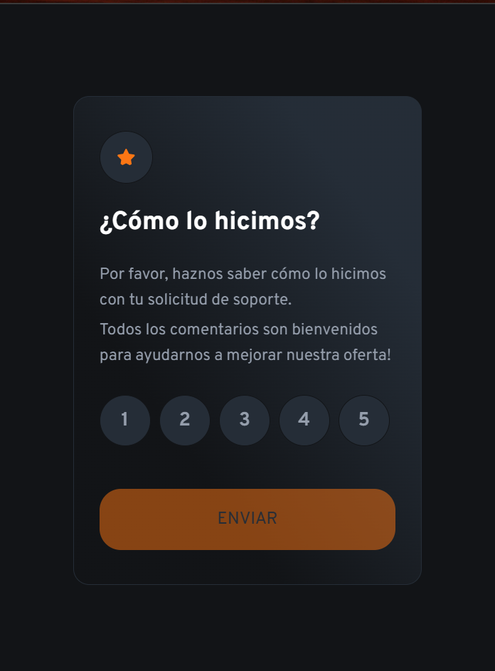

# Challenge 1 - Ejercicio examen modulo 1

Construir un componente de calificación interactivo y lograr que se vea lo más cercano posible al diseño.

Utilizando cualquier herramienta HTML, CSS, JavaScript puro (vanilla) y Astro.

La funcionalidad de tus usuarios debe ser:

-   Ver el diseño óptimo de la aplicación sin tener en cuenta el tamaño de la pantalla de su dispositivo (mobile-only).
-   Ver estados de hover para todos los elementos interactivos en la página
    Seleccionar y enviar una calificación numérica.
-   Ver la tarjeta de agradecimiento después de enviar una calificación.

## Dónde encontrar todo

-   Tu tarea es construir el proyecto según los diseños proporcionados como imágenes PNG. Usar PNGs significará que necesitarás usar tu mejor juicio para estilos como font-size, padding y margin.

-Encontrarás todos los recursos necesarios en la carpeta /images. Los recursos ya están optimizados.

-También hay un archivo style-guide.md que contiene la información que necesitarás, como la paleta de colores y las fuentes.

### Construyendo tu proyecto

-   Crea un repositorio git con un README.md personalizado.
-   Enlaza tu proyecto como un repositorio público en GitHub. Será tu forma de entregar el proyecto.
-   Configura tu repositorio para publicar tu código en una dirección web.
-   Revisa los diseños para comenzar a planificar cómo abordarás el proyecto. Este paso es crucial para ayudarte a pensar con anticipación en las clases de CSS para crear estilos reutilizables.
-   Antes de agregar cualquier estilo, estructura tu contenido con HTML. Escribir tu HTML primero puede ayudar a centrar tu atención en crear contenido bien estructurado.
    Crea las variables de CSS para los colores y fuentes en el archivo style-guide.md. Esto te proporcionará un lugar central para almacenar estos valores para que puedas mantenerlos y actualizarlos fácilmente.
    Escribe los estilos base para tu proyecto, incluyendo estilos generales de contenido, como font-family y font-size.
    Comienza a agregar estilos desde la parte superior de la página y trabaja hacia abajo.
    Ten en cuenta las limitaciones de tiempo. No es necesario que completes todo el diseño. Si no puedes terminar todo, asegúrate de que tu proyecto esté completo y funcional antes de enviarlo.

Desplegando tu proyecto
Como se mencionó anteriormente, hay muchas formas de alojar tu proyecto de forma gratuita. Nuestros hosts recomendados son:

GitHub Pages
Vercel
Netlify
Puedes alojar tu sitio utilizando una de estas soluciones o cualquiera de nuestros otros proveedores de confianza.
